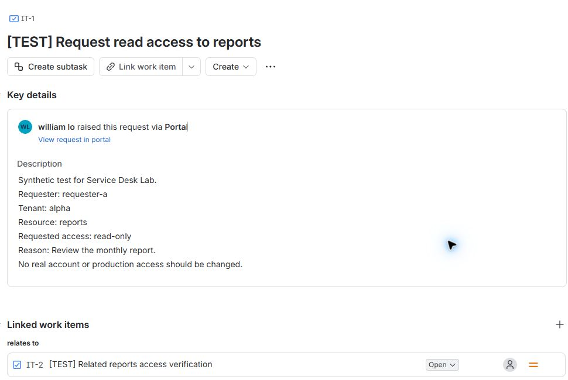
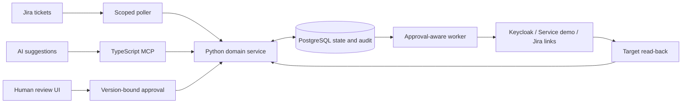

# Jira Service Desk Automation & MCP Server

[](https://github.com/williamlo90/ai-service-desk-ticket-operations-assistant/actions/workflows/ci.yml)

A Jira service request becomes a controlled action in Keycloak, verified at the target and recorded back in Jira. A custom TypeScript MCP server gives AI clients bounded ticket tools; Python policy, PostgreSQL state, and human approval govern execution.

[See the IT-1 integration walkthrough](docs/JIRA-TO-KEYCLOAK-WALKTHROUGH.md) · [MCP tool contract](mcp-server/README.md) · [Operator guide](docs/phase-8/HANDOVER.md) · [Documentation](docs/README.md)



In the [connected local lab](docs/phase-5/human-approved-access.json), William approved a read-only grant for `requester-a` to `reports`. Keycloak read-back confirmed membership in `reports-reader`; the local case closed. A later [Jira issue property write](docs/phase-5/jira-result-write.json) stored the verified result. Jira's workflow status and comments were not changed.

The screenshot is the actual **synthetic test ticket**. [Walk through the evidence and boundaries](docs/JIRA-TO-KEYCLOAK-WALKTHROUGH.md).

## Why this project

Service desk automation crosses a consequential boundary: understanding a ticket is
not permission to change access or restart a service. A successful HTTP response
also does not prove the requested outcome happened.

This project separates those decisions. It supports three bounded journeys:
**read-only access requests**, **service incident recovery**, and **related-ticket
linking**. Missing information produces a clarification. Ambiguous execution stays
open for reconciliation. Only verified outcomes permit local closure.

## Validated results

| Area | Result | Evidence |
| --- | --- | --- |
| Current regression suite | Python, MCP, guidance and approval-page checks | [CI](https://github.com/williamlo90/ai-service-desk-ticket-operations-assistant/actions) |
| AI triage | OpenAI passed 16/16 held-out synthetic cases | [Evaluation](docs/phase-6/evidence-v1/openai-heldout.json) |
| Bounded release exercise | 48 synthetic HTTP journeys plus fault/recovery fixtures | [Release report](docs/phase-7/release-lab.json) |
| Human approval | Browser-approved Jira IT-1 access grant verified in Keycloak | [Connected evidence](docs/phase-5/human-approved-access.json) |
| Jira integration | Related-ticket link, paginated reads and metadata write/read-back | [Jira check](docs/phase-5/jira-connected-check.json) |
| Source delivery | Clean install, locked dependencies and offline recovery demo | [Phase 8 handover](docs/phase-8/README.md) |

These are local lab results. The held-out set is synthetic and internally designed;
no production performance or business ROI is claimed. OpenAI is the accepted lab
profile. Ollama remains experimental; additional providers and Azure are deferred.

## IT-1: request to verified access

1. **Read and clarify.** Ingest a bounded Jira request, extract source-backed facts,
   and ask for missing information.
2. **Prepare.** Apply deterministic policy and persist a versioned action proposal.
3. **Approve.** A human supervisor reviews the exact payload. The model cannot
   grant itself approval.
4. **Execute and reconcile.** A durable operation identity prevents replay from
   creating a second effect; uncertain outcomes require target read-back.
5. **Verify and close.** Persist the verified result and audit. Write bounded Jira
   result metadata; local closure does not change the Jira workflow status.

The [IT-1 walkthrough](docs/JIRA-TO-KEYCLOAK-WALKTHROUGH.md) shows the connected path. Jira is the request surface, MCP exposes bounded tools, and a small browser page records independent human approval.

## Architecture



| Layer | Responsibility |
| --- | --- |
| Browser approval | Human review of a version-bound proposal; no action is executed by the page |
| TypeScript MCP | Strict tool schemas, scoped calls and a reference client |
| Python domain service | Policy, tenant boundaries, proposal versions and lifecycle |
| PostgreSQL | Durable state, compare-and-swap, audit and job ownership |
| Worker and adapters | Approved actions, idempotent recovery and target verification |
| Local supervisor | Child-process recovery and bounded health diagnostics |

**Stack:** Python 3.12–3.13, PostgreSQL, TypeScript/Node.js, MCP, native HTML/JavaScript,
Primer CSS, Jira Service Management, Keycloak and a local service simulator.

The selected runtime is **code-led**. [ADR 003](docs/architecture/ADR-003-selected-code-led.md)
explains why transactional state and recovery ownership stay in Python/PostgreSQL;
n8n comparison workflows remain available as supporting material.

## Try it locally

Python 3.12 or 3.13 is enough for the offline demo and UI preview. Neither requires
Docker, a model API key, or a Jira account.

```sh
git clone https://github.com/williamlo90/ai-service-desk-ticket-operations-assistant.git
cd ai-service-desk-ticket-operations-assistant
python scripts/demo_handover.py
python scripts/preview_workspace.py
```

Open the URL printed by the preview. Its public fixture token is `preview-only-`
followed by 32 `x` characters. This disposable in-memory preview has no execution
worker or external targets. See the [approval-page guide](docs/WEB-UI.md).

Run the offline checks with Python and Node.js 22:

```sh
cd backend
python -m unittest discover -s tests
cd ..
npm ci --prefix mcp-server
npm test --prefix mcp-server
node scripts/check_quote_tools.cjs
node --test scripts/check_approval_ui.cjs
```

Connected setup requires PostgreSQL, sandbox targets and local credentials:
follow [deployment setup](deploy/README.md) and the [operator handover](docs/phase-8/HANDOVER.md).

## Engineering notes

- [Connected Jira to Keycloak walkthrough](docs/JIRA-TO-KEYCLOAK-WALKTHROUGH.md)
- [Case study: approval and uncertain outcomes](docs/CASE-STUDY.md)
- [Security boundaries and disclosure](SECURITY.md)
- [Human approval page](docs/WEB-UI.md)
- [Phase 7 release and recovery evidence](docs/phase-7/CURRENT.md)
- [Phase-by-phase learning guide](docs/learning/README.md)
- [Delivery scope and deferred Azure phase](PHASES.md)

Historical phase gates describe their recorded source revisions. Current regression
checks run in CI. Credentials and runtime state remain outside version control;
CI scans Git history and enforces forbidden-path checks.

## Delivery scope

The accepted local lab has operator documentation, recovery procedures and named
support ownership. Cloud hosting is optional and requires separate acceptance.
Future changes start with native tests, then use a reserved runtime session for
affected integrations. Historical results retain their original environment and
phase references.
