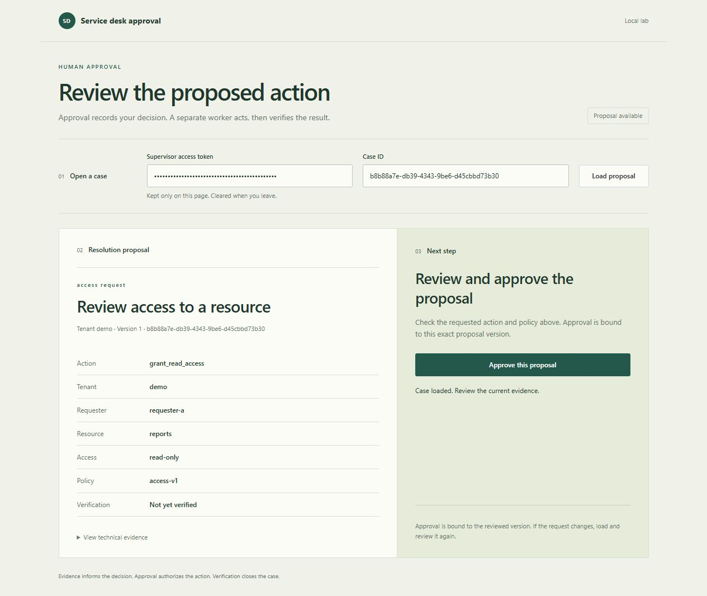

# Human approval page

This project is a Jira and MCP integration, not a standalone case-management
application. Jira holds the request. The TypeScript MCP server exposes bounded
ticket tools. The small loopback browser page exists for one purpose: a supervisor
must review and explicitly approve the exact action proposed by the backend.

The image uses disposable synthetic data. It illustrates the review surface,
not the historical William approval session. The [IT-1 walkthrough](JIRA-TO-KEYCLOAK-WALKTHROUGH.md)
links the connected approval and Keycloak read-back evidence.

## Operator flow

1. Open the local operator service at port 5681 with a case ID.
2. Enter the supervisor token, then load the proposal.
3. Review the tenant, source request, action, resource, policy version and target
   verification state. Technical evidence is available in the disclosure.
4. Approve the reviewed version only if it is correct. The separate worker may
   then execute; approval itself does not change Jira or Keycloak.
5. Reload to see the later result. An uncertain action stays open for target
   read-back or operator reconciliation.

The token is kept only in page memory and cleared on exit. Changing the token or
case invalidates the loaded proposal, including late responses. Closed cases remain
readable; started or uncertain actions cannot be approved again.

For a credential-free preview, run `python scripts/preview_workspace.py`. Open
the printed loopback URL on port 5683 and enter `preview-only-` followed by
32 `x` characters. This disposable in-memory fixture has no worker, Jira,
Docker, model calls or private configuration.

## Implementation

The page is native HTML and JavaScript served by the Python API. A pinned,
MIT-licensed Primer CSS 22.3.2 stylesheet supplies the controls; a small local
stylesheet handles the review layout. The vendored CSS and license live under
`backend/service_desk/web/vendor/`. There is no separate `frontend/` project,
frontend build, remote font, analytics or credential storage.

The separate Phase 6 diagnostic pilot and its evaluation data remain available,
but the former AI practice page has been removed from the operator experience.

## Validation

The approval controller has behavioral checks for untrusted text, payload-bound
approval, stale responses, changed identity or case, closed and uncertain cases,
and token clearing. Python runtime checks cover the served page and its
same-origin protections. The current checks run in [CI](https://github.com/williamlo90/ai-service-desk-ticket-operations-assistant/actions).
