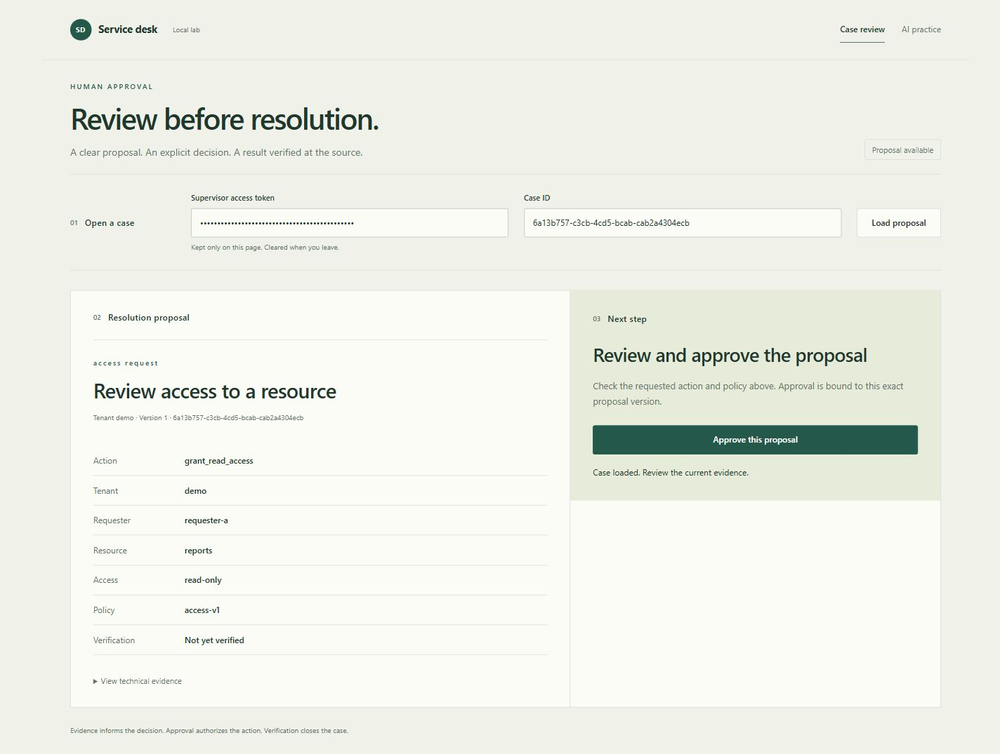
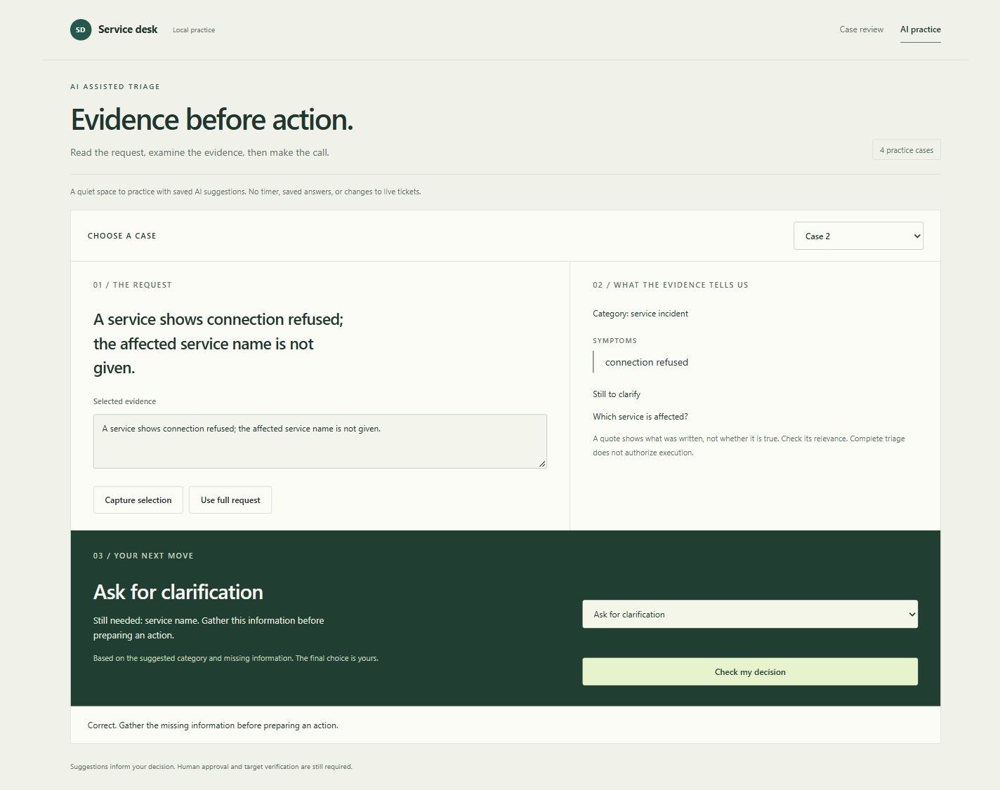

# Browser workspace

A local operator workspace for reviewing a proposal and deciding the next step.
The UI uses native HTML/JavaScript and official Primer CSS 22.3.2 components. It
adds no frontend runtime, remote fonts, analytics, or credential storage.

## Case review

The screenshot shows the real application with disposable **synthetic** data.
The preview token is a public fixture, accepted only by the isolated preview server.

1. Enter a supervisor token and case ID on the existing lab at port 5681.
2. Read the tenant, action, resource, access level, policy, and verification state.
3. Approve the reviewed version. A separate worker executes; target read-back
   determines whether the case can close.

Closed cases remain readable. Started or uncertain actions cannot enable another
approval. Editing the token or case invalidates the loaded review, including late
responses. Technical evidence remains available in a disclosure below the proposal.

For a credential-free preview, run `python scripts/preview_workspace.py`. Open the
printed loopback URL on port 5683 and use `preview-only-` followed by 32 `x`
characters. It uses an in-memory case and target, with no worker, Jira, Docker,
model calls, or private config. Stopping the process discards its fixture state.

## AI practice

Run `python scripts/business_pilot.py` and open `http://127.0.0.1:5682/practice`.
Four cached OpenAI examples support quote selection, field evidence, missing-field
questions, and an explicit recommendation with a reason. The operator still selects
the next step. Practice performs no model calls, business actions, or answer writes.
The completed human pilot and its original observations are unchanged.

## Design and implementation

The workspace follows the review itself: request, evidence, decision. Thin top
navigation replaces the sidebar. A warm paper surface, asymmetric reading columns,
fine separators and an evergreen decision band establish hierarchy without a grid
of dashboard cards. The case connection form is a compact strip above the proposal.

- Direction: document-led operator workbench; variance 6, motion 1, density 5.
- Foundation: official Primer CSS controls, native HTML/JavaScript, system typography.
- Language: English interface, questions, recommendations and feedback. Source quotes
  retain their original text so exact-evidence checks remain meaningful.
- Responsive behavior: reading columns stack below 700px; top navigation remains
  visible and the approval form stacks on narrow screens.
- Accessibility: labeled native controls, visible focus, skip navigation, live feedback,
  readable source excerpts and reduced-motion support.
- Behavior: identity, payload-bound approval, independent execution, cached examples
  and exact quotes are preserved. No new business or model calls are introduced.

Rebuild the MIT-licensed vendored CSS with `npm ci --prefix frontend` and
`npm run build --prefix frontend`. Marketing imagery and animation are not needed
for this workspace; no Lighthouse score is claimed.

## Validation, 2026-10-09

- 183 Python tests, 8 MCP tests, 14 quote/next-step assertions, and 7 approval UI
  behavioral tests passed after the revision.
- Browser: actual proposal load and synthetic approval passed; approval did not
  trigger execution. Cached clarification example returned the correct feedback.
- Desktop 1280px and mobile 390px checked. Both pages fit the mobile viewport
  without horizontal overflow. [Mobile capture](assets/ai-practice-mobile.jpg).
- Behavioral tests cover stale responses, changed identity/case, text-safe untrusted
  content, payload-bound approval, closed/uncertain cases, and token clearing.
- Runtime health was ready after reloading only this project's API and practice server.

Phase 5–8 reports remain evidence for their recorded revisions. This UI extension
has its own validation above; it does not retroactively change those snapshots.

## Current visual check

The English workbench was checked in the browser at desktop and mobile widths.
The selected source quote, missing-service question, clarification recommendation
and decision feedback remain connected. Screenshots use synthetic cases from the
actual application. The completed historical pilot observations were not changed.
